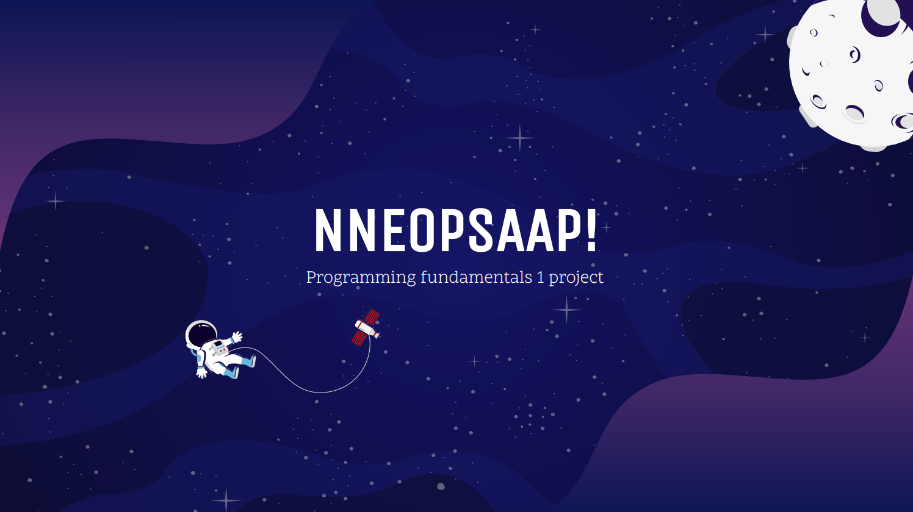

# NNEOPSAAP

## Table of Contents
1. [General Info](#general-info)
2. [How to run the program](#how-to-run-the-program)
3. [How it works](#how-it-works)
4. [Instructions](#instructions)

## General Info
***
National Near Earth Object Preparedness Strategy and Action Plan is a game which was designed to be
easily playable while providing an enjoyable experience to the player. It is extremely rewarding as it is
created to be a single player game that is connected to a main server or a main arena in order to promote
competitiveness and diversify the playerbase.

The game is solely written in Racket and is therefore executed by compiling the source code and running
the Main.rkt file. The leaderboard software however is not written in racket as it is an additional feature we
decided to implement in this project. The leaderboard requires a combination of programming languages
due to its complexity and can be found on the cerfeda.com. All interactions to the website and changes to
the database are submitted through racket afterwhich a game attempt can be evaluated and compared to
previous runs

Overall we believe that the game offers a pleasant experience with the enjoyable and intuitive interface. The
game is easy to use and is ran with only one command. It can run on multiple systems and the leaderboard is
accessible even from mobile devices. This makes this project for a perfect cross-platform gaming experience
with some added trivia in the form of the game title.

## How to run the program
***
To execute the game you need to have Racket installed.
```
$ Main.rkt
```
And to execute the webserver 

```
$ ./spaceleaderboard/run.sh
```

## How it works
***
As the player runs the game, he is greeted with a our so called ”Asteroid Launcher”. This window serves
a purpose of introducing the options implemented throughout the development of the project in order to
make a player comfortable before committing to run the game, rather than entering a game immediately on
source code compilation.

